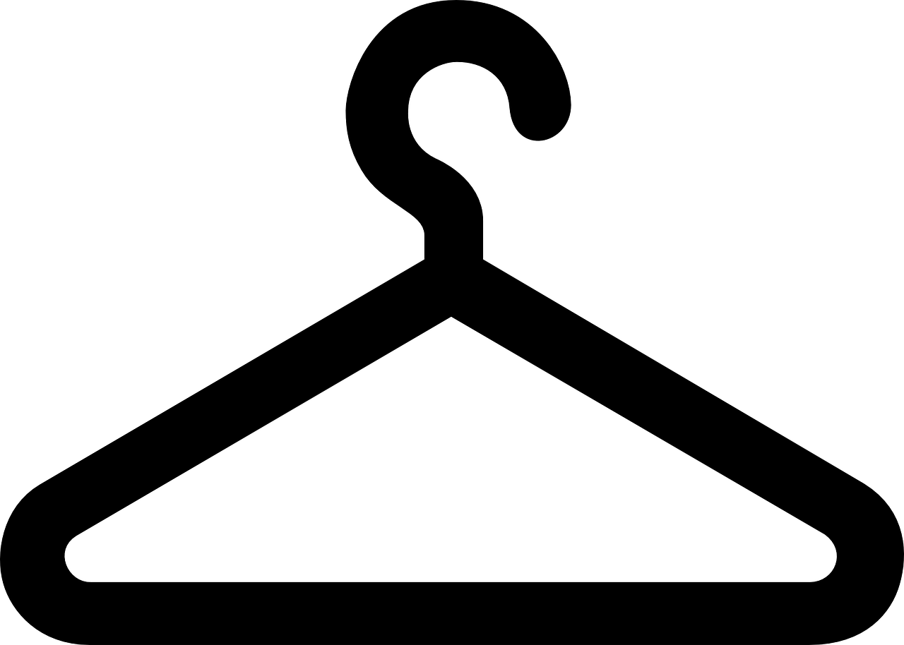

# DrobeApp
## Vision:

 This project consists of team members James Cowley, Elham Ul Islam, Rigo Lizaola, Blake Jameson, and Mackenzie Toliver.

 We are creating an application where you have access to a virtual wardrobe. Here, you can save the different outfits and clothes you have.

Anyone who has interest in fashion or clothes to any extent is in for a great experience.

We're wanting to create a place where those who love clothing and the possibility of endless styles have somewhere they can find home in. This is a place where one can seek to find enjoyment and inspiration from friends as they share their outfits. We aim for this community to be a welcoming place that one can find joy in.

## Table of Contents
- [DrobeApp](#drobeapp)
  - [Vision:](#vision)
  - [Table of Contents](#table-of-contents)
  - [General Information](#general-information)
  - [Technologies Used](#technologies-used)
  - [Features](#features)
    - [Sprint 1](#sprint-1)
      - [Contributions](#contributions)
<!-- * [License](#license) -->

## General Information
- 

## Technologies Used
- [React](https://react.dev)
- [Python](https://www.python.org)
- [FastAPI](https://fastapi.tiangolo.com)
- [MySQL](https://www.mysql.com)

## Features

Sprint 1 Contributions

Feature 1: Organization for Developers

- As a developer, I would like the repo to have some early set up in the form of organizing the directories, creating a database and its tables, and CSS styling that will be able to be used for different site pages.

  - **Tasks:**
    - Set Up initial directory structure
    - Create basic CSS styling that will be used for different pages
    - Develop script that creates database and tables forTypesOfClothing and ArticlesOfClothing
    - Develop script that creates ArticleToImage, OutfitsByUser and ArticlesToOutfits db tables
    - Develop script that creates ArticlesToOutfits and WebSession DB tables
    - Test database and table creation scripts on multiple machines
    - New Team Set Up

 
Feature 2: Homepage for Drobe App

- As a user, I would like to see a well designed website so that I can navigate the page easily. CP-7
  - **Tasks:**
    - Plan Layout of Homepage
    - Create basic layout using HTML/CSS
    - Create "My Outfits" and "My Closet" overview on homepage
    - Create Recommended Outfit section
    - Test homepage layout on multiple devices to make sure it is responsive.
    
 
Feature 3: My Closet Page

- As a user, I want a well designed "closet" page, so that I can easily see what piece of clothes I own. CP-8
  - **Tasks:**
    - Plan layout of My Closet page
    - Develop basic layout of page
    - Develop grid based mapping of clothing items
    - Implement database for My Closet
    - Develop API endpoints
  
  
 
Feature 4: Add Clothing to My Closet

- As a user, I would like to be able to add clothing to My Closet, so that I can easily organize my clothes and create outfits. CP-9
  - **Tasks:**
    - Create "add clothing" button and form in modal
    - Plan layout and connections to database
    - Develop form and integrate with database
    - Develop editing existing clothing articles.
    - Test Add Clothing form, make sure it works with backend
    - Develop API endpoint to delete their clothing article
  
 
Feature 5: My Outfit Page

- As a user, I would like an Outfit page that allows me to view, create, and save outfits using items from my wardrobe so that I can easily plan and organize what I wear for different occasions. CP-15
  - **Tasks:**
    - Plan the Outfit Page Layout
    - Create the page Layout
    - Link outfits to database
    - Add functionality to save outfits
    - Make favorites functionality and/or filtering
    - Develop API endpoint to create outfit in DB

 

### Sprint 1

#### Contributions

**James**: "provided users with a homepage to see an overview of their closet and outfits."
  
  - `Jira Task: James - Plan layout of homepage`
    - [CP-10](https://cs3398-romulans-f24.atlassian.net/browse/CP-10),
    [Bitbucket](https://bitbucket.org/cs3398-romulans-f24/drobeapp/commits/branch/feature%2FCP-10-plan-layout-of-homepage)
  
  - `Jira Task: James - Create basic layout using HTML/CSS`
    - [CP-11](https://cs3398-romulans-f24.atlassian.net/browse/CP-11),
    [Bitbucket](https://bitbucket.org/cs3398-romulans-f24/drobeapp/commits/branch/feature%2FCP-11-create-basic-layout-using-html-css)
 
  - `Jira Task: James - Create Recommeded Outfit section`
    - [CP-14](https://cs3398-romulans-f24.atlassian.net/browse/CP-14),
    [Bitbucket](https://bitbucket.org/cs3398-romulans-f24/drobeapp/branch/feature/CP-10-plan-layout-of-homepage)
  
  - `Jira Task: James - Create basic CSS styling that will be used for different pages`
    - [CP-38](https://cs3398-romulans-f24.atlassian.net/browse/CP-38),
    [Bitbucket](https://bitbucket.org/cs3398-romulans-f24/drobeapp/commits/branch/feature%2FCP-36-initial-repo-and-styling-set-up)
 
  - `Jira Task: James - Create "My Outfits" and "My Closet" overview on homepage`
    - [CP-90](https://cs3398-romulans-f24.atlassian.net/browse/CP-90),
    [Bitbucket](https://bitbucket.org/cs3398-romulans-f24/drobeapp/commits/branch/feature%2FCP-14-create-recommended-outfit-section)
  
  - `Jira Task: James - Test homepage layout on multiple devices to make sure it is responsive.`
    - [CP-12](https://cs3398-romulans-f24.atlassian.net/browse/CP-12),
    [Bitbucket](https://bitbucket.org/cs3398-romulans-f24/drobeapp/commits/branch/feature%2FCP-12-test-homepage-layout-on-multiple-d)

 
  
    **Elham - Worked on Database Scripts, API endpoints and frontend for Outfit Page**
      - CP-16 Plan the Outfit Page Layout (Elham)
        - https://cs3398-romulans-f24.atlassian.net/browse/CP-16?atlOrigin=eyJpIjoiZTAxYTQ3M2Q3OTNiNGY3YWE3NmZjNGIzODg5NjFjNTIiLCJwIjoiaiJ9

      - CP-17 Create the page layout (Elham)
        - https://cs3398-romulans-f24.atlassian.net/browse/CP-17?atlOrigin=eyJpIjoiNDQzMjlhMzVlNzM2NGVlMjk4YTg0MjY5YzUxNzlkYWYiLCJwIjoiaiJ9

      - CP-60 Develop API endpoints to retrieve data from DB (Elham)
        - https://cs3398-romulans-f24.atlassian.net/browse/CP-60?atlOrigin=eyJpIjoiYTU5OWExYjc1NjA3NDJkM2E0Y2UxZTRlNjAzMWVkMWMiLCJwIjoiaiJ9

      - CP-85 Research APIs (Elham)
        - https://cs3398-romulans-f24.atlassian.net/browse/CP-85?atlOrigin=eyJpIjoiMmIzYzhmOGNkMjQ3NGQ2Mjk5M2Q4OWM2MmRmMWU0OGEiLCJwIjoiaiJ9

      - CP-86 Develop API endpoints to handle a user modifying their clothing articles (Elham)
        - https://cs3398-romulans-f24.atlassian.net/browse/CP-86?atlOrigin=eyJpIjoiOTA1MWI2ZTcwZGM5NDQzZDg1MmFiNGQ4MDIyM2NlYzYiLCJwIjoiaiJ9

      - CP-41 Develop script that creates UserInfo and WebSession DB tables  (Elham)
        - https://cs3398-romulans-f24.atlassian.net/browse/CP-41?atlOrigin=eyJpIjoiZTJhNmI3M2JmY2EzNDljMThiMjIxOGI3M2JhMzFiZTgiLCJwIjoiaiJ9

      - CP-40 Develop script that creates ArticleToImage, OutfitsByUser and ArticlesToOutfits db tables (Elham)
        - https://cs3398-romulans-f24.atlassian.net/browse/CP-40?atlOrigin=eyJpIjoiOTBmMjNkNDQyNDM2NDllMmJlY2Q4OTY1ZTRhY2NjN2UiLCJwIjoiaiJ9

 

**Mackenzie**: "Devloped API endpoints to retrieve outfits, create an outfit, and delete a clothing article. Also updated the database creation script and created a script for teammates to alter their DB field names for 2 tables"
  
  - `Jira Task: Mackenzie - Develop API endpoints that retrieves Outfits`
    - [CP-89](https://cs3398-romulans-f24.atlassian.net/browse/CP-89),
    [Bitbucket](https://bitbucket.org/cs3398-romulans-f24/%7Bc2902cac-f2c6-4e67-a5af-d9c16186ffc0%7D/branch/feature/CP-89-develop-api-endpoints-that-retriev)
  
  - `Jira Task: Mackenzie - Develop API endpoint to create an outfit in the DB`
    - [CP-88](https://cs3398-romulans-f24.atlassian.net/browse/CP-88),
    [Bitbucket](https://bitbucket.org/cs3398-romulans-f24/%7Bc2902cac-f2c6-4e67-a5af-d9c16186ffc0%7D/branch/CP-88-develop-api-endpoint-to-create-an-)
  
  - `Jira Task: Mackenzie - Set Up because of New Team`
    - [CP-92](https://cs3398-romulans-f24.atlassian.net/browse/CP-92),
    [Bitbucket](https://bitbucket.org/cs3398-romulans-f24/%7Bc2902cac-f2c6-4e67-a5af-d9c16186ffc0%7D/branch/feature/CP-92-set-up-because-of-new-team)
  
  - `Jira Task: Mackenzie - Develop API endpoint to allow user to delete their clothing article`
    - [CP-87](https://cs3398-romulans-f24.atlassian.net/browse/CP-87),
    [Bitbucket](https://bitbucket.org/cs3398-romulans-f24/%7Bc2902cac-f2c6-4e67-a5af-d9c16186ffc0%7D/branch/feature/CP-87-develop-api-endpoint-to-allow-user)
  

**Blake**: "Devloped API endpoints to allow a user to create a clothing article, developed scripts to create DB and 2 tables. Helped implement functionality to filter clothes by type on the 'My Closet' page, created unit tests for API endpoints."
  
  - `Jira Task: Blake - Set Up initial directory structure`
    - [CP-37](https://cs3398-romulans-f24.atlassian.net/browse/CP-37),
    [Bitbucket](https://bitbucket.org/%7B298d1d14-4211-4ef6-8545-a3b968aef311%7D/%7Bc2902cac-f2c6-4e67-a5af-d9c16186ffc0%7D/pull-requests/1)
 
  - `Jira Task: Blake - Develop script that creates database and tables forTypesOfClothing and ArticlesOfClothing`
    - [CP-39](https://cs3398-romulans-f24.atlassian.net/browse/CP-39),
    [Bitbucket](https://bitbucket.org/%7B298d1d14-4211-4ef6-8545-a3b968aef311%7D/%7Bc2902cac-f2c6-4e67-a5af-d9c16186ffc0%7D/pull-requests/1)
 
  - `Jira Task: Blake - Test database and table creation scripts on multiple machines`
    - [CP-42](https://cs3398-romulans-f24.atlassian.net/browse/CP-42),
    [Bitbucket](https://bitbucket.org/cs3398-romulans-f24/%7Bc2902cac-f2c6-4e67-a5af-d9c16186ffc0%7D/branch/feature/CP-42-test-database-and-table-creation-s)
 
  - `Jira Task: Blake - Creating Javascript function that calls backend API to store clothing article image and data`
    - [CP-62](https://cs3398-romulans-f24.atlassian.net/browse/CP-62),
    [Bitbucket](https://bitbucket.org/cs3398-romulans-f24/%7Bc2902cac-f2c6-4e67-a5af-d9c16186ffc0%7D/branch/feature/CP-62-creating-javascript-function-that-)
  
  - `Jira Task: Blake - update "add clothing" button to delete 2 of the current fields and create dropdown for item type`
    - [CP-96](https://cs3398-romulans-f24.atlassian.net/browse/CP-90),
    [Bitbucket](https://bitbucket.org/cs3398-romulans-f24/%7Bc2902cac-f2c6-4e67-a5af-d9c16186ffc0%7D/branch/feature/CP-96-update-add-clothing-button-to-dele)
  
  - `Jira Task: Blake - Ensure database and API functionality is working properly for My Closet`
    - [CP-59](https://cs3398-romulans-f24.atlassian.net/browse/CP-59),
    [Bitbucket](https://bitbucket.org/cs3398-romulans-f24/%7Bc2902cac-f2c6-4e67-a5af-d9c16186ffc0%7D/branch/feature/CP-59-ensure-database-and-api-functional)
  
  - `Jira Task: Blake - Create unit tests for all API endpoints defined for 'My Closet' page`
    - [CP-83](https://cs3398-romulans-f24.atlassian.net/browse/CP-83),
    [Bitbucket](https://bitbucket.org/cs3398-romulans-f24/%7Bc2902cac-f2c6-4e67-a5af-d9c16186ffc0%7D/branch/feature/CP-83-create-unit-tests-for-all-api-endp)

  - `Jira Task: Blake - Develop API endpoints to store data in DB`
    - [CP-84](https://cs3398-romulans-f24.atlassian.net/browse/CP-84),
    [Bitbucket](https://bitbucket.org/cs3398-romulans-f24/%7Bc2902cac-f2c6-4e67-a5af-d9c16186ffc0%7D/branch/feature/CP-84-develop-api-endpoints-to-store-dat)

  - `Jira Task: Blake - Make filtering functionality for the My Closet Page`
    - [CP-94](https://cs3398-romulans-f24.atlassian.net/browse/CP-94),
    [Bitbucket](https://bitbucket.org/cs3398-romulans-f24/%7Bc2902cac-f2c6-4e67-a5af-d9c16186ffc0%7D/branch/feature/CP-94-make-filtering-functionality-for-t)

  - `Jira Task: Blake - Implement functionality to load clothing articles into the "My Closet" overview section`
    - [CP-95](https://cs3398-romulans-f24.atlassian.net/browse/CP-95),
    [Bitbucket](https://bitbucket.org/cs3398-romulans-f24/%7Bc2902cac-f2c6-4e67-a5af-d9c16186ffc0%7D/branch/feature/CP-95-implement-functionality-to-load-cl)
    

    
 

 Next Steps
    Sprint 2
    James Cowley
    Elham Ul Islam
    Rigo Lizaola
    Blake Jameson
    Mackenzie Toliver
     - **Tasks:**
      - Develop API endpoint  to delete outfit images
      - Develop API endpoint to delete all articles of clothing in outfits
      - Develop API endpoint for deleting clothing article image

